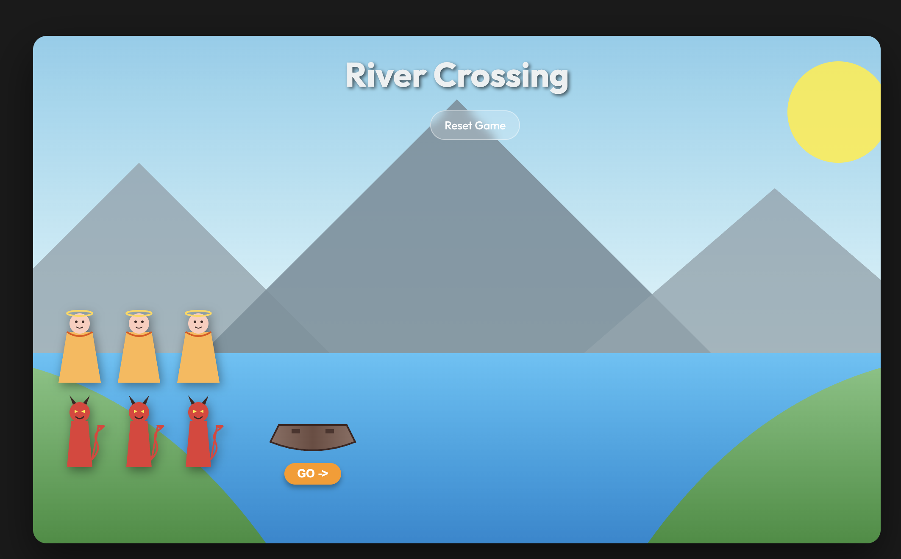
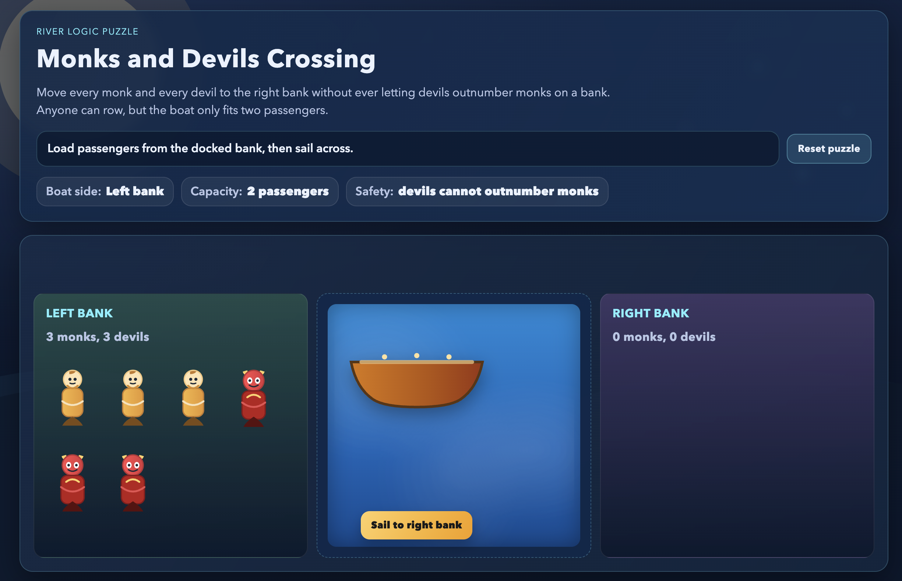
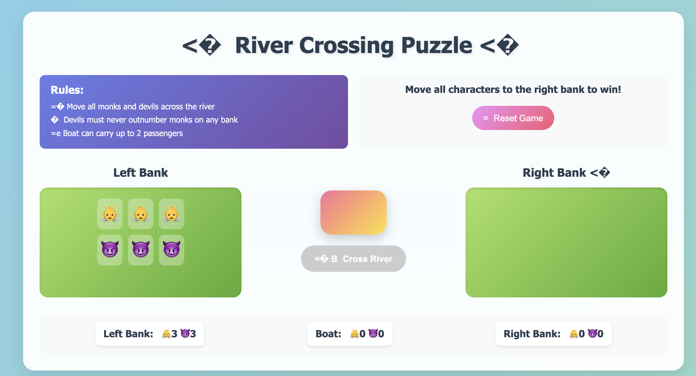
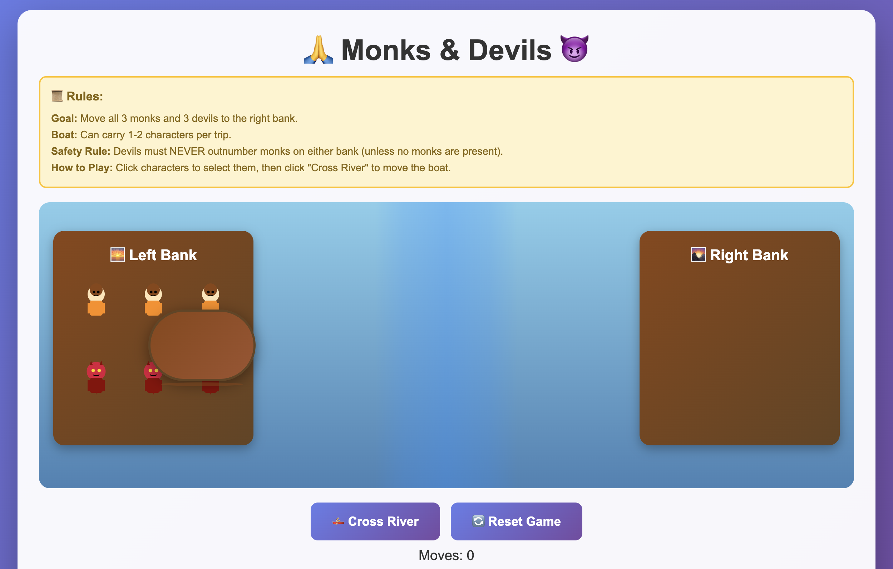

# README

Testing the model for the cross the river game.

## Prompt

Results are from the prompt’s first run only.

```
Goal

Move all monks and all devils from the left bank to the right bank using a small boat.

Using HTML , CSS and JS. Create your own image for background , mock, devil, boat. you can

To keep the monks safe, the following rule must always be true on both banks and in the boat:

➡ Devils must never outnumber monks.

More formally:

  On any bank (left or right),
  if monks > 0, then
    devils ≤ monks
    must be true — otherwise the devils “overpower” the monks (lose condition).

❌ Lose Condition

  You lose if on either bank, the number of devils is greater than the number of monks while
  there
  is at least one monk present.

🏁 Win Condition

  All monks and devils safely reach the right bank following the rules.
```

## Result

| Name | Work | Good UI |
|-----| ------ | ------ |
| Gemini 3 Pro (High) | Yes | Yes |
| GPT 5.1-codex-max (xhigh) | No | Normal |
| GLM 4.6       | Yes | No |
| Claude 4.5    | No  | No |


## Gemini 3 Pro (High)



## GPT 5.1-codex-max (xhigh)



## GLM 4.6



## Claude 4.5


